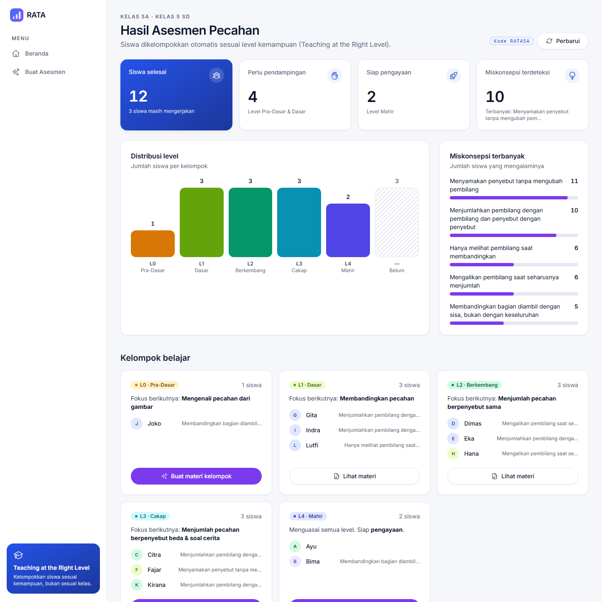
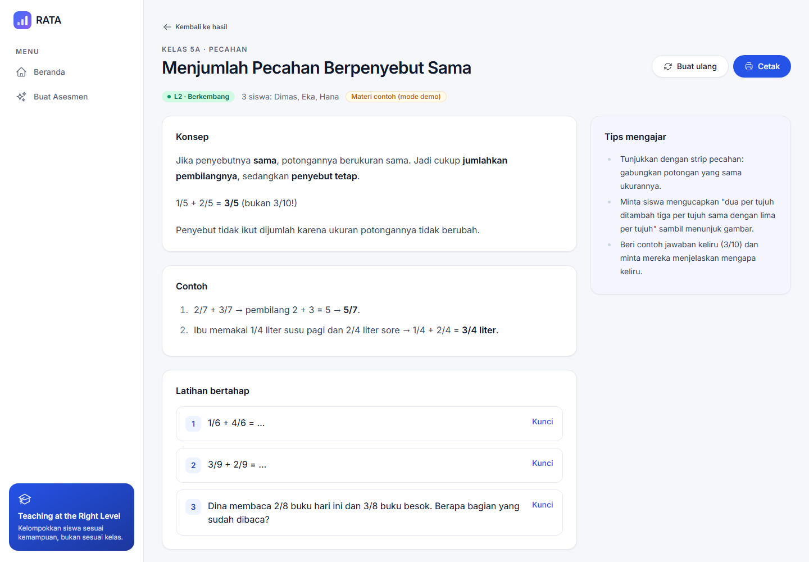
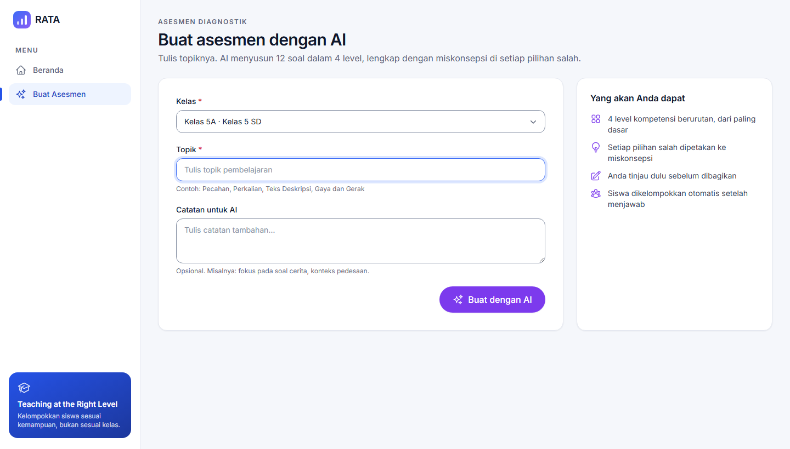
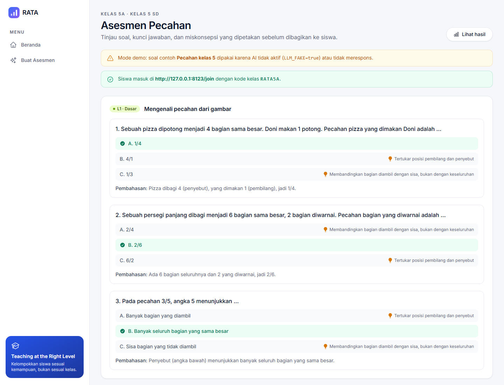
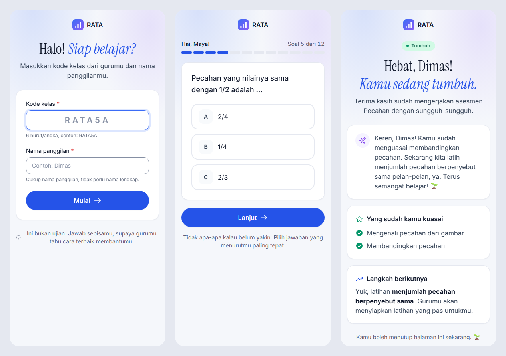

# RATA — Ruang Ajar Tepat Level

> **Setiap anak belajar di level yang tepat.**
> Project Hackathon SEMESTA 8 · Tech Career Academy by SEVIMA · Tema *Empowering Youth for a Sustainable Future: Build with AI* · SDG 4 Quality Education

RATA membantu guru menjalankan **asesmen diagnostik → pengelompokan siswa per level → materi berdiferensiasi** dalam hitungan menit, bukan hari. Pendekatannya mengikuti *Teaching at the Right Level* (TaRL).

1. **Guru menulis topik.** AI membuat 12 soal diagnostik dalam 4 level, dan setiap pilihan salah diberi label miskonsepsi.
2. **Siswa mengerjakan dari HP** cukup dengan kode kelas dan nama. Level dihitung **secara deterministik** (tanpa AI) supaya konsisten dan bisa diaudit.
3. **Dashboard guru** mengelompokkan siswa per level dan menampilkan miskonsepsi terbanyak. AI lalu membuat materi yang berbeda untuk tiap kelompok.

Detail produk: [docs/PRD.md](docs/PRD.md) · Design system: [docs/DESIGN.md](docs/DESIGN.md) (contoh hidup di `/ui-kit`) · Proses pemilihan ide: [docs/BRAINSTORMING.md](docs/BRAINSTORMING.md)

## Tampilan

| Dashboard hasil (guru) | Materi per kelompok (AI) |
|---|---|
|  |  |
| **Buat asesmen dengan AI** | **Soal diagnostik + miskonsepsi** |
|  |  |

**Alur siswa (mobile):** masuk dengan kode kelas → satu soal per layar → hasil tanpa skor


## Fitur

| Untuk | Fitur |
|---|---|
| Guru | Buat kelas (kode otomatis) · **Buat asesmen dengan AI** dari topik · tinjau soal, kunci, dan miskonsepsi · publikasikan |
| Guru | **Dashboard hasil**: KPI, distribusi level, miskonsepsi terbanyak, kelompok belajar per level |
| Guru | **Materi per kelompok buatan AI**: konsep, contoh, 3 latihan bertahap, tips mengajar · bisa dicetak / dibuat ulang |
| Siswa | Masuk dengan kode kelas + nama panggilan (tanpa akun) · satu soal per layar · hasil tanpa skor, dengan umpan balik AI yang menyemangati |
| Sistem | Penilaian level **deterministik** · validasi skema output AI + retry · **mode demo tanpa API key** (`LLM_FAKE=true`) |

## Alur Demo (±3 menit)

1. `composer run setup` lalu `composer run dev` → buka http://localhost:8000.
2. **Guru** → `/guru`: data demo *Kelas 5A* (kode **RATA5A**) sudah berisi 12 siswa. Klik **Lihat hasil** untuk melihat dashboard kelompok.
3. Di kartu kelompok, klik **Buat materi kelompok** → materi berdiferensiasi muncul.
4. **Buat Asesmen** → isi topik → AI menyusun 12 soal 4 level (atau soal contoh bila mode demo).
5. **Siswa** → `/join` (buka di HP / mode responsif), kode `RATA5A` + nama → kerjakan 12 soal → halaman hasil.
6. Kembali ke dashboard guru → klik **Perbarui**: siswa baru langsung masuk kelompoknya.

Design system dan contoh semua komponen ada di `/ui-kit`.

## Tech Stack

| Lapisan | Teknologi |
|---|---|
| Backend | Laravel 12 (PHP 8.2+) |
| Frontend | Blade, Tailwind CSS v4, Alpine.js (tanpa SPA, ringan untuk HP) |
| Database | SQLite |
| AI | Claude API (`claude-haiku-4-5`, bisa diganti lewat `LLM_MODEL`) |

## Menjalankan Secara Lokal

Prasyarat: PHP 8.2+, Composer, Node.js 20+.

```bash
git clone https://github.com/ahmdims/sevima-rata.git
cd sevima-rata
composer run setup   # install dependensi, buat .env, APP_KEY, database SQLite + data demo, build aset
composer run dev     # php artisan serve + Vite
```

Buka http://localhost:8000.

<details>
<summary>Langkah manual (tanpa <code>composer run setup</code>)</summary>

```bash
composer install
cp .env.example .env
php artisan key:generate
touch database/database.sqlite
php artisan migrate:fresh --seed
npm install && npm run build
php artisan serve
```
</details>

### Konfigurasi AI

| Variabel `.env` | Default | Keterangan |
|---|---|---|
| `ANTHROPIC_API_KEY` | — | API key Claude. |
| `LLM_MODEL` | `claude-haiku-4-5` | Model yang dipakai. |
| `LLM_FAKE` | `true` | `true` = memakai data contoh tanpa memanggil API, sehingga demo tetap jalan tanpa API key atau internet. |
| `LLM_TIMEOUT` | `60` | Timeout request (detik). |
| `LLM_MAX_RETRIES` | `2` | Jumlah retry jika output AI tidak lolos validasi skema. |

Untuk memakai AI sungguhan, isi `ANTHROPIC_API_KEY` dan set `LLM_FAKE=false`.

## Testing

```bash
php artisan test
```

## Struktur Penting

```
config/rata.php                 Konfigurasi LLM, aturan level, nama level
resources/css/app.css           Design token (warna, font, level) — lolos kontras WCAG 2.2 AA
resources/views/components/ui/  UI kit Blade (<x-ui.button>, <x-ui.card>, <x-ui.level-badge>, …)
resources/views/components/layouts/  Layout base, guru, siswa
docs/                           PRD, design system, brainstorming, materi tema hackathon
```

## Materi Submission

| Output | File |
|---|---|
| Slide deck (10 slide) | [docs/submission/RATA-Slide-Deck.pdf](docs/submission/RATA-Slide-Deck.pdf) · sumber: [slides.html](docs/submission/slides.html) |
| Narasi teknis (≤500 kata, 5 field) | [docs/submission/RATA-Narasi-Teknis.pdf](docs/submission/RATA-Narasi-Teknis.pdf) · sumber: [NARASI_TEKNIS.md](docs/NARASI_TEKNIS.md) |
| Skenario demo video (≤5 menit) | [docs/PRD.md §15](docs/PRD.md) |
| Dokumen produk | [PRD](docs/PRD.md) · [Design System](docs/DESIGN.md) · [Brainstorming](docs/BRAINSTORMING.md) |

## Alur Pengembangan

Branch utama `master`. Setiap fitur dikerjakan di branch sendiri (`feat/…`, `fix/…`, `chore/…`, `docs/…`) dan di-merge ke `master` dengan `--no-ff` setelah terverifikasi.
